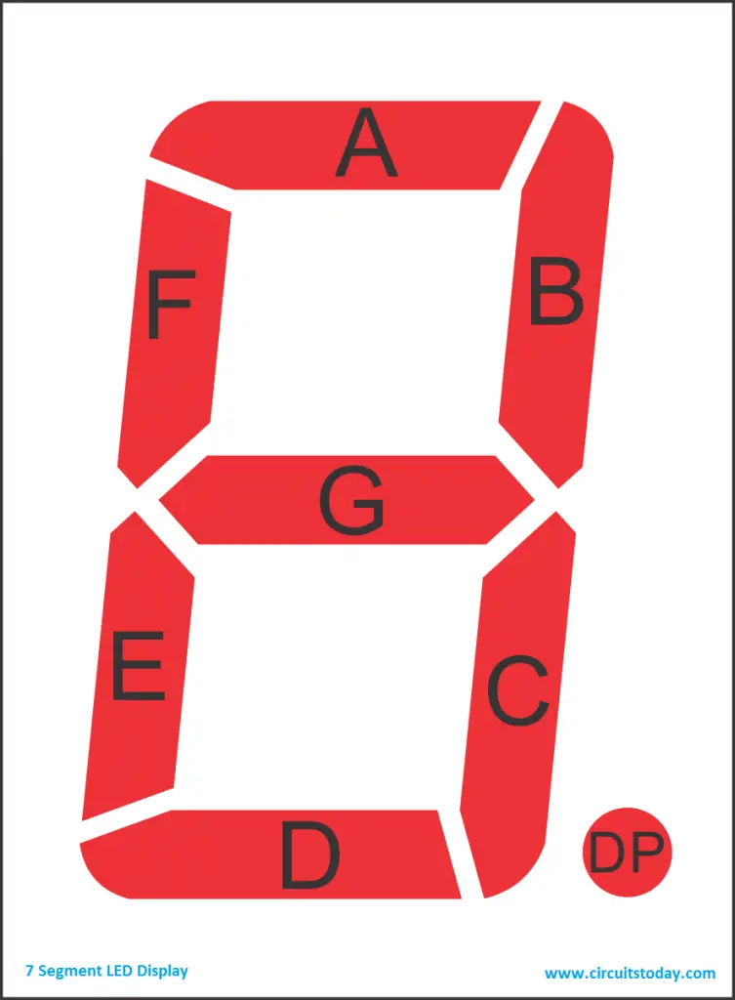

# Minekarnaugh

## Implementation

The 7 Segment is implemented by creating a series of logic gates for each segmen
ts. The logic gates are determined using the Karnaugh Map. Each segment are mapp
ed from A to G, and the input are mapped to b0 as the least significant bit to b
3 as the most significant bit.

The 7 segment is created in Minecraft Bedrock Edition in my Android Phone (i wan
t to die).

Seven segment display mapping:

I used [this website](https://www.electricaltechnology.org/2018/05/bcd-to-7-segment-display-decoder.html)
as a reference for the base karnaugh map (mainly because I'm too lazy to relearn
boolean algebra), then simplify the logic gates on some of the segments.

| Segment | Expression                            |
|---------|---------------------------------------|
| A       | b3 + b2 + !(b1 ^ b0)                  |
| B       | !b2 + !(b1 ^ b0)                      |
| C       | b2 + !b1 + b0                         |
| D       | b3 + !b2!b0 + !b2b1 + b1!b0 + b2!b1b0 |
| E       | !b0(!b2 + b1)                         |
| F       | b3 + b2(!b1 + !b0) + !b1!b0           |
| G       | b3 + b2!b1 + !b2b1 + b1!b0            |

Note:
- (+): OR
- (!): NOT
- (^): XOR
- Two adjacent mapping: AND

Lastly, I used [this website](https://minecraft.fandom.com/wiki/Redstone_circuits/)
for the implementation of logic gates in minecraft.
